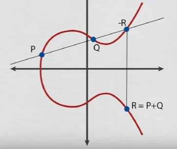

# Introduction to MPC and TSS

Secure multi-party computation (SMPC/MPC) allows multiple participants to collaboratively compute a pre-agreed function without the need for a trusted third party. This concept originated from Professor Andrew Yao's millionaire problem and its solution using cryptography in 1982. The scheme, which is an interaction between two people, could find out who was richer without revealing their actual wealth. It allows users to collaborate on calculations with each other without revealing any sensitive information. MPC has since evolved into an important branch of modern cryptography.

# Motivating Example

Imagine that a group of 3 researchers is working on a joint project, and each has developed an innovative algorithm with different results. The researchers want to collaborate to find out which of the algorithms is the most efficient, i.e. which has the shortest runtime. However, each researcher considers the details of their own work confidential and does not want to reveal their exact results to the others. To solve this, they need to determine which algorithm is the fastest without exposing each other's runtimes.

<div style="text-align: center;">
    
</div>

The problem can be represented by the function:

$$F(t_1, t_2, t_3) = min(t_1, t_2, t_3)$$

​where $t_1, t_2, t_3$ are the execution times of each of the researchers algorithms.

A simple solution would be for everyone to reveal their execution times to a third party who could calculate the minimum value. However, since they don't trust any external entity to handle this sensitive data, they need a way to find the result without revealing their times to anyone else.

Using a multi-party computation (MPC) protocol, researchers could collaborate to determine which algorithm is the fastest. The protocol would ensure that everyone contributes their execution time to the function, but without anyone being able to infer the others' times beyond knowing which one was the fastest. This way, they can compare their algorithms without compromising the confidentiality of their research.

The two main properties of MPC are correctness and privacy:
- Correctness: The output produced by an algorithm is correct (as expected).
- Privacy: The secret input data that one party possesses will not be leaked to the other parties.

## MPC in Blockchain

To improve the security of digital assets on the blockchain, MPC has been introduced in the multi-signature scenario. Multiple key fragments are used to compute the final signature using MPC protocols during the signing process. This signature can be verified using the corresponding unique public key. This technique, known as MPC multi-signature, provides a highly secure and efficient way to secure digital assets on the blockchain.

We will use MPC to compute a digital signature in a distributed manner. Let us see how the above properties can be applied to signatures. Recall that, for signatures, we have three steps:

- Key generation: The first step is also the most complex. We need to generate a key that will be public and used to verify future signatures. But we also need to generate an individual secret for each party, which we will call the shared secret. In terms of correctness and privacy, we say that the function will generate the same public key for all parties and a different shared secret for each of them, so that: (1) privacy: no data is leaked from the secrets shared between the parties, and (2) correctness: the public key is a function of the shared secrets.

- Signature: This step involves a signature generation function. The input of each party will be its secret part, created as an output of the previous step (distributed key generation). There is also a public input known to all, which is the message to be signed. The output will be a digital signature, and the privacy property ensures that no leaks of secret parts occur during the computation.

- Verification: The verification algorithm remains as in the classical setup. To support single-key signatures, everyone who knows the public key should be able to verify and validate the signatures. This is exactly what blockchain validation nodes do.

Threshold Signature Scheme (TSS) is the name we give to this composition of distributed key generation (DKG) and distributed signature of a threshold signature scheme.

## TSS in Blockchain

We can create a new address by generating a private key and then computing the public key from the private key. Finally, the blockchain address is derived from the public key. Using TSS, we would have a set of n parties jointly computing the public key, each of which owns a secret part of the private key (individual parts are not revealed to the other parties). From the public key, we can derive the address in the same way as in the traditional system, making the blockchain independent of how the address is generated. The advantage is that the private key is no longer a single point of failure because each party owns only a part of it.

Distributed key generation can be done in a way that allows for different types of access structures: the general “$t$ of $n$” configuration will be able to withstand up to $t$ arbitrary failures in operations involving the private key, without compromising security.

- $\left\lbrace t - n \right\rbrace$ means that the threshold is $t$ and the number of participants is $n$. At least $t$ participants are required to recover the private key and sign a message.
- $\left\lbrace n - n \right\rbrace$ means the threshold is $n$ and the number of participants is $n$.

# Implementing an MPC Wallet

- An MPC wallet uses multiparty computation technology to improve the security of your cryptocurrencies and other digital assets. It splits a wallet's private key between multiple parties to increase privacy and reduce the risks of hacks, breaches, and losses. Each party independently creates a private key as part of the MPC wallet's private key to sign messages. Different keys never encounter each other, no party has access to the full private key, thus eliminating single points of failure.. The interactive nature of the MPC wallet setup processes requires all parties to be present during the action.

# MPC and TSS using Elliptic Curve Cryptography

Elliptic Curve Cryptography (ECC) is a modern family of public-key cryptosystems. This type of cryptography is based on the algebraic structures of elliptic curves over finite fields $(\mathbb{F}_p)$ where $p$ is a large prime number, for example 256 bits, and on the difficulty of the elliptic curve discrete logarithm problem (ECDLP). ECC implements all the main capabilities of asymmetric cryptosystems: encryption, signatures, and key exchange. For this demonstration for educational purposes only, we will work with the elliptic curve defined over the finite field for a prime $p = 17$ by the equation in Weierstrass form:

$$E(\mathbb{F}_{17}): y^2 = x^3 - 2x + 7 \mod (17)$$

```rust
let new_ec: EcWei::new(-2, 7, 17);
```

In summary an elliptic curve over the finite field $\mathbb{F}_{p}$ consists of:
- a set of integer coordinates $\left( x, y \right)$, such that $0 \leq x , y < p$
- staying on the elliptic curve: $y^2 \equiv x^3 + ax + b \mod (p)$

You can check if any point belongs to the defined curve:
```rust
println!("{:?}", new_ec.is_point(&Point::new(4,7))); // false
println!("{:?}", new_ec.is_point(&Point::new(8,4))); // true
```

<div style="text-align: center;">
    
</div>

This elliptic curve has properties that make it ideal for cryptographic operations. Being defined over a finite field, the set of solutions of the curve (the points) form a finite abelian group under the operation of adding points on the curve. The curve we are using has a group of order 11, that is, there are 11 points in total that form this group, including the point at infinity, which acts as the neutral element in the addition operation. I invite you to create new Weierstrass-type elliptic curves by passing the new integer values ​​for $a$, $b$ and $p$ in that order to the following method:
```rust
let new_ec: EcWei::new(a, b, p);
```

It is beautiful to observe the possibility of expressing a binary operation on a finite set using a table. In this set, which is formed by all the points that satisfy the Weierstrass curve equation, one of the properties that it satisfies is that we can add any two points and obtain a point that belongs to the same set. We implement the sum of two points in the following way:
    
<div style="text-align: center;">
    
    
</div>

```rust
println!("{:?}", new_ec.point_add(&Point::new(8,4), &Point::new(8,4))); // (0,15)
println!("{:?}", new_ec.point_add(&Point::new(8,4), &Point::new(6,7))); // (1,11)
```
As long as this set satisfies the properties of an algebraic group structure, we can construct a Cayley table. You can observe the Cayley table for the group formed by the elliptic curve created, using the following method:

```rust
let group_add = new_ec.group_points();
new_ec.cayley_table(&group_add);
```
<div style="text-align: center;">
    
</div>

## The "Generator" Point in ECC

One of the most relevant properties of this curve is that it satisfies a special condition: all points in the group can act as generators of the group. We will note that this property is fundamental for the arithmetic operations that will be performed on the scalar field that defines this group, i.e. $\mathbb{F}_{11}$. A generator is a point $G$ such that any other point on the curve can be obtained as a combination of the point $G$ added to itself, $G \cdot n$ (i.e., by scalar multiplication). We can select any point on the curve $E(17): y^2 = x^3 - 2x + 7 \mod (17)$ as the generator $G$ of the group. This is possible thanks to the property that the order of $G$ is the number of elements in the group. We mean by order of $G$ the number of times this point must be summed to generate the point at infinity ($\infty$), which in this case is the identity element of the group. Note that if we instantiate another Weierstrass curve for example $E(17): y^2 = x^3 - 3x + 4 mod (17)$ there are points that do not generate all the other elements of the group and these will not be taken as generating points for the group of the curve:
```rust
let other_ec = EcWei::new(-3, 4, 17);
println!("{:?}", other_ec.scalar_mul(Point::new(6,10), &mut 2)); // (6,7)
println!("{:?}", other_ec.scalar_mul(Point::new(6,10), &mut 3)); // (0,0) = ∞
println!("{:?}", other_ec.scalar_mul(Point::new(6,10), &mut 4)); // (6,10)
println!("{:?}", other_ec.scalar_mul(Point::new(6,10), &mut 5)); // (6,7)
println!("{:?}", other_ec.scalar_mul(Point::new(6,10), &mut 6)); // (0,0)
println!("{:?}", other_ec.scalar_mul(Point::new(6,10), &mut 7)); // (6,10) = ∞
```
We can say that the point (6,10) generates only three points in the group given by the curve $E(\mathbb{F}_{17}): y^2 = x^3 - 3x + 4 \mod (17)$, which is the same as (6,10) being of order 3.

## ECDSA

Private keys in ECC are integers (in the range of the curve field size, typically 256-bit integers). Key generation in ECC cryptography is as simple as securely generating a random integer in a given range, so it is extremely fast. Any number within the range is a valid ECC private key. Public keys in ECC are EC points - integer coordinate pairs (x, y), which lie on the curve. One of the most common uses of elliptic curves in cryptography is the Elliptic Curve Digital Signature Algorithm (ECDSA). In this algorithm, security is based on the difficulty of solving the discrete logarithm problem on the set of points on the curve. That is, given a generated public key, it is computationally difficult to find the private key. Let's generate some ECDSA key pairs from a generating point and we can generate public keys for private keys. For educational purposes we work on the curve $E(\mathbb{F}_{17}): y^2 = x^3 - 2x + 7 \mod (17)$. 

### Key generation: ECDSA
1. Select a generator point $G$ (belonging to $E(\mathbb{F}_{17})$ of order $n$. For this curve all points are of order $n = 11$, the number of elements in the set.
2. Randomly select a number $d$ in the interval $[1, n - 1]$.
3. Calculate $Q = dG$.
4. $d$ will be the private key. Note that at point 2 if $d > n-1$, another private key $d_1 < d$ also generates $Q$ and this is not desired.
5. $Q$ will be the public key.

```rust
let generators =  new_ec.get_base_points(&group_add);
let point_g =  generators[0];
let key_pair_1 = new_ec.gen_key_pair(&point_g);
println!(" Generator {:?} -> {:?} Part 1",point_g, key_pair_1.unwrap());
```

The main drawback of using a traditional setup to generate ECDSA keys in an MPC wallet to sign and verify ECDSA signatures, is that it creates a single point of failure. If each user possesses a full copy of the private key, any user could compromise the security of the protocol. By generating the private key in fragments and distributing these fragments among MPC participants, the risk of a single individual representing a point of vulnerability for the system is eliminated. Therefore, it is necessary to modify the protocol to avoid this single point of failure. Instead of each user having direct access to the full private key, a key fragment generation and distribution scheme must be implemented. In this way, control is decentralized, and the protocol becomes more secure.

### TSS setup with ECDSA: For two parties
1. Party 1 chooses a random number $d_1$ where $0 < d_1 < n$. Calculates $Q_1 = d_1G$.
2. Part 2 chooses a random number $d_1$ where $0 < d_2 < n$. Calculate $Q_2 = d_2G$.
```rust
let key_pair_2 = new_ec.gen_key_pair(&point_g);
println!(" Generator {:?} -> {:?} Part 2",point_g, key_pair_2.unwrap());
```
3. Each party will send $Q_1​$ or $Q_2$ ​to each other such that Party 2 will calculate $Q=Q_1d_2$ and Party 1 will calculate $Q=Q_2d_1$​. Both parties must arrive at the same point $Q$ where $Q = d_1d_2G$. This cryptographic method that allows two parties with no prior knowledge of each other to establish a shared secret over a public channel is known as the Diffie-Hellman key exchange.
```rust
let part_1_dh = new_ec.scalar_mul(&key_pair_2.as_ref().unwrap().pk, &key_pair_1.as_ref().unwrap().sk);
let part_2_dh = new_ec.scalar_mul(&key_pair_1.as_ref().unwrap().pk, &key_pair_2.as_ref().unwrap().sk);
println!("The Diffie-Hellman protocol is followed -> {:?}", &part_1_dh == &part_2_dh);
```
4. Part 1 will also generate a Paillier key pair with a modulus $N$ and send an encrypted version of its secret $d_1$​, $c_{key} =Enc(d_1)$, with Paillier's public key to Part 2. For the Paillier protocol we set some values ​​for educational purposes, usually to achieve required security levels we work with large numbers for example 256 bits.
    - **Paillier key generation**:
        - We select any 2 prime numbers ($p = 11$ and $q = 3$). We calculate $N = pq = 33$.
        - $λ = lcm(p - 1, q - 1) = 10$, where lcm is the least common multiple
        - We randomly select an integer $g$ that belongs to $`\mathbb{Z}^{*}_{N^2} = \mathbb{Z}^{*}_{33^2} = \{1,2,3,...,1087,1088\}`$
        - We ensure that $N$ divides $g$ by checking the following multiplicative inverse $μ$:
            $μ = (L(g^λ \mod  N^2))^{-1} \mod  N$ where $L$ is the function $L(x) = \dfrac{x - 1}{N}$
            $μ = (L(g^λ \mod 1089))^{-1} \mod 33$
        - Then private key: $(λ,μ)$ and public key: $(g,N)$.
        ```rust
        let paillier_key_p1 = gen_key_paillier(BigInt::from_i64(11).unwrap(), BigInt::from_i64(3).unwrap());
        println!(" Part 1 -> {:?}", &paillier_key_p1);
        ```
    - **Encrypting $d_1$ with Paillier** :
        - We randomly select an integer $r$ that belongs to $Z^*_{N} = Z^*_{33}$ and whose greatest common divisor with $N$ is equal to 1. That is, $gcd(r,N) = 1$. Note that if $gcd(r,N) \neq 1$ the private key can be calculated correctly with little probability.
        - Encryption: $$c_{key} = Enc(d_1) = g^{d_1} * r^N \; mod \; N^2 = g^{d_1} * r^{33} \; mod \; 1089$$
        ```rust
		let chiper_p1 = cipher_paillier(&paillier_key_p1.public_key, &key_pair_1.as_ref().unwrap().sk);
    	println!(" Encrypting the secret {:?} of Part 1 -> {:?}", &key_pair_1.unwrap().sk, &chiper_p1.unwrap());
		```
    - **Decryption**: $$d_1 = Dec(c_{key})= L(c_{key}^λ \;\;(mod \;N^2)) * μ \;(mod \;N) = L(c_{key}^λ \;(mod \;1089)) * μ \;(mod \;33)$$
        ```rust 
        let dechiper_p1 = decipher_paillier(&paillier_key_p1.private_key, chiper_p1.as_ref().unwrap ().clone(), &paillier_key_p1.public_key);
        println!(" Decrypting chipher ({:?}) -> {:?}", &chiper_p1.as_ref().unwrap(), &dechiper_p1);
        ```
5. In the end, Party 1 has a private and public key pair: $(d_1,Q)$ and Party 2 has a public and private key pair $(d_2, Q, c_{key})$.

Why a Paillier key pair? Paillier encryption is used so that operations can be performed on another party's private key without revealing the private key. Paillier exhibits both additive and multiplicative homomorphic properties.

Decryption by multiplying two ciphertexts together results in $m_1 + m_2$. Where $m_1$ and $m_2$ are the plaintexts for the ciphertexts. This property is what we call additive homomorphism: $$Dec(Enc(m_1, r_1) * Enc(m_2, r_2)) = m_1 + m_2$$ Decryption by raising a ciphertext to the power of another plaintext will result in $m_1 * m_2$ where $m_1$ and $m_2$ are the plaintexts for the ciphertexts. This property is what we call multiplicative homomorphism: $$Dec(Enc(m_1, r_1)^{m_2}) = m_1*m_2$$

> To achieve this property it is necessary that both parties have the same public key $(g, N)$. It is a cryptographic assumption the computational problem of factoring $N$ to obtain the Pailler private key. In theory this problem is hard for Party 2, or any attacker.

### Digital Signature using MPC: (TSS $\left\lbrace 2 - 2 \right\rbrace$)

Whenever a user wants to initiate a transaction, a signature is created for all other users of the MPC protocol to verify and approve. If the signature is valid, the instruction is approved. Otherwise, if the signature is invalid, the instruction is not approved and there is something fishy about the user.

Typically, an MPC wallet uses ECDSA for signatures. From the key generation and distribution processes of SSSS (Shamir Secret Sharing Scheme), the private key is kept secret and cannot be recovered by an attacker. The ECDSA signature is published to all parties in the MPC protocol, and everyone can verify it.
1. Select a generator point $G$ (belonging to $E$) of order $n$.
2. Randomly select a number $k$ in the interval $[1, n - 1]$.
3. Calculate $r$ as the x-coordinate of $P = kG$.
4. Calculate $s=k^{−1}∗(H(M)+r∗d)$ where $d$ is the private key and $H(M)$ is the message hash.
5. Obtain the signature as $(r,s)$.
Anyone with the public key with respect to $d$ can use the values ​​of $r$ and $s$ to validate the message signature. Note that $r$ and $s$ are integers such that $0 < r < n$, $0 < s < n$.

In the case of ECDSA signature, in a threshold setting, the parameters are modified a bit. In a two-party ECDSA signature scheme, both parties have the message $M$ to be signed and the public generator point $G$ on the elliptic curve. The joint public key $Q$ is created from an elliptic curve Diffie-Hellman (ECDH) key exchange where both parties compute their own secrets and obtain a shared point. This process is carried out in point 2.2

Party 2 will receive $c_{key}$ ​under Paillier cryptosystem, so that the calculation can be performed with the encrypted version $d_2$ by Party 2 and decrypted by Party 1. The private key of the Paillier encryption is generated by Party 1 and kept secret. The message hash is denoted as $H(M)$​, and the order of the curve is denoted as $n$.

> The number of bits in the message hash cannot be greater than the order of the curve.

**The signature protocol is as follows:**
1. Party 1 chooses a random $k_1$, computes $R_1 = k_1 * G$, and publishes a ZK proof about the knowledge of $k_1$ along with $R_1$ to Party 2.
 	```rust
	let mut rng = rand::thread_rng();
    let k1 = BigInt::from(rng.gen_range(1..group_add.len()));
    println!("     k1 = {}", &k1);
    let point_r1 = new_ec.scalar_mul(&points_g[0], &k1); 
    println!("     R1 = {:?}", &point_r1);
 	```
2. Party 2 picks a random $k_2$, computes $R_2 = k_2 * G$, and publishes a ZK proof about the knowledge of $k_2$ along with $R_2$ to Party 1.
 	```rust
 	let k2 = BigInt::from(rng.gen_range(2..group_add.len()));
    println!("     k2 = {}", &k2);
    let point_r2 = new_ec.scalar_mul(&points_g[0], &k2);
    println!("     R2 = {:?}", &point_r2);
	```
The x-coordinate of $R_1$ and $R_2$ are required to be different from 0, modulo the order of the curve, otherwise it returns to point one. A ZK proof is required to ensure that the points $R$ are computed from a multiple of the generator $G$ and not from a maliciously created point.

3. Assuming that each proof is verified by the corresponding party, Party 2 computes $R = k_2*R_1 = k_1*k_2*G$ where $r$ is the x-coordinate of $R$.
    ```rust
    println!(" Shared secret Part 1 (R = {:?})", new_ec.scalar_mul(&point_r2, &k1));
    println!(" Shared secret Part 2 (R = {:?})", new_ec.scalar_mul(&point_r1, &k2));
    ```
4. By the homomorphism property of the Paillier cipher, Part 2, given $c_{key}$, computes a series of Paillier sums and multiplications.
    - Part 2 generates a random number $0\leq\rho< n^2$, where $n$ is the order of the curve. We further ensure that $gcd(\rho, N) = 1$ and use the public key to compute $$c_1 = Enc(\rho*n + k^{-1}_2*H(M)) = Enc(\rho*11 + k^{-1}_2*H(M))$$
        ```rust
	    let mut hash_message_p2 = Sha256::new();
        hash_message_p2.update(message.as_bytes());
        let hash_result_p2 = hash_message_p2.finalize();
        let hash_message_p2_to_ec = BigInt::from_bytes_be(num_bigint::Sign::Plus, &hash_result_p2) % BigInt::from(2_u32.pow((&group_add.len() + 1) as u32);
        let mut rho = paillier_key_p1.public_key.1.clone();
        while basic_op::gcd(&rho, &paillier_key_p1.public_key.1.clone()) != BigInt::from(1) {
            rho = BigInt::from(rng.gen_range(1..(group_add.len() + 1).pow(2)));
        }
        let inv_k2 = basic_op::inv_mod(&k2, &BigInt::from(group_add.len() + 1));
        let c1 = cipher_paillier(&paillier_key_p1.public_key, &((&rho * &BigInt::from(group_add.len() + 1) + inv_k2.as_ref().unwrap() * &hash_message_p2_to_ec) % &BigInt::from(group_add.len()))
        );
	    ```
    - Part 2 calculates $v = k^{-1}_2*r*d_2$ and multiplies it by $c_{key}$ (encrypted version of $d_1$) to get $c_2$.
        ```rust 
        let v = (inv_k2.as_ref().unwrap() * &new_ec.scalar_mul(&point_r1, &k2).x * &key_pair_2.as_ref().unwrap().sk) % BigInt::fro (group_add.len () + 1);
        let c2 = ckey.as_ref().unwrap().modpow(&v, &paillier_key_p1.public_key.1.pow(2));
        ```
    - Party 2 computes $c_3 = c_1 + c_2$.
        ```rust
        let c3 = (c1.as_ref().unwrap() * &c2).modpow(&BigInt::one(), &paillier_key_p1.public_key.1.pow(2));
        ```
    - Party 2 sends $c_3$ to Party 1.
    - Party 1 computes $R = k_1*R_2$ and extracts $r$ where $r$ is the x coordinate of $R$. This should result in the same $R$ as in Step 3. Party 1 decrypts $c_3$ to obtain $s'$ and computes $s = k^{-1}_1*s'$. The signature is then published in the form $(r, s)$. If $s$ is equal to 0, return to point 1. 
        ```rust 
        let mut s = decipher_paillier(&paillier_key_p1.private_key, c3, &paillier_key_p1.public_key);
        let r = new_ec.scalar_mul(&point_r2, &k1).x % BigInt::from(group_add.len() + 1);
        s = (s * inv_mod(&k1, &BigInt::from(group_add.len() + 1)).unwrap()) % BigInt::from(group_add.len() + 1);
        ```

### Signature Verification

All parties in the MPC protocol have access to the public key, published by the user for signing. The verification process varies depending on the signature algorithm, but each user can individually verify the signature using the published public key. For ECDSA, as long as the signature and the message are published, anyone with the public values ​​can verify the validity of the signature. In both the regular and two-party ECDSA protocols, the verification algorithm is the same. The algorithm is as follows:
1. Compute $H(M)$ with the same hash function of the signature algorithm.
2. Compute $u_1 = H(m) * s^{-1}$.
3. Compute $u_2 = r * s^{-1}$.
4. If r is the x-coordinate of $G*u_1 + Q*u_2 = r$, then the signature is verified. Otherwise, the signature is invalid. Here, $Q = G*d$ where $d$ is the private key used to sign the message $M$.
```rust
let mut hash_message_verifier = Sha256::new();
hash_message_verifier.update(message.as_bytes());
let hash_result_verifier = hash_message_verifier.finalize();
let hash_message_verifier_to_ec = BigInt::from_bytes_be(num_bigint::Sign::Plus, &hash_result_verifier) % BigInt::from(2_u32.pow((&group_add.len() + 1) as u32));
let u1 = (hash_message_verifier_to_ec * inv_mod(&s, &BigInt::from(group_add.len() + 1)).unwrap()) % BigInt::from(group_add.len() + 1);
let u2 = (&r * inv_mod(&s, &BigInt::from(group_add.len() + 1)).unwrap()) % BigInt::from(group_add.len() + 1);
let x = new_ec.point_add(&new_ec.scalar_mul(&points_g[0], &u1), &new_ec.scalar_mul(&point_g, &u2)).x;
if &r == &(x % BigInt::from(group_add.len() + 1)) {
    println!("    The signature ({:?}, {:?}) is correct...", &r, &s)
} else {
    println!("    The signature ({:?}, {:?}) is incorrect...", &r, &s)
}
```